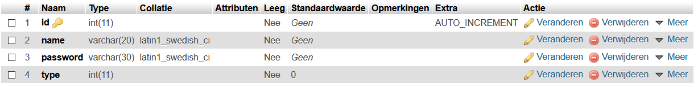

# inlogsysteem-php2

Simple login system written in PHP that I made for a YouTube tutorial. [View the video here](https://youtu.be/0_Sr9a0whH8)  

## Setup Database

If you had trouble setting up the database, you can see the database structure below. I use MySQL, like always. If you are curious how to setup a local database, I recommend [xampp](https://www.apachefriends.org/index.html). You can see a tutorial about how to setup xampp here: [xampp FAQ](https://www.apachefriends.org/faq_windows.html)

